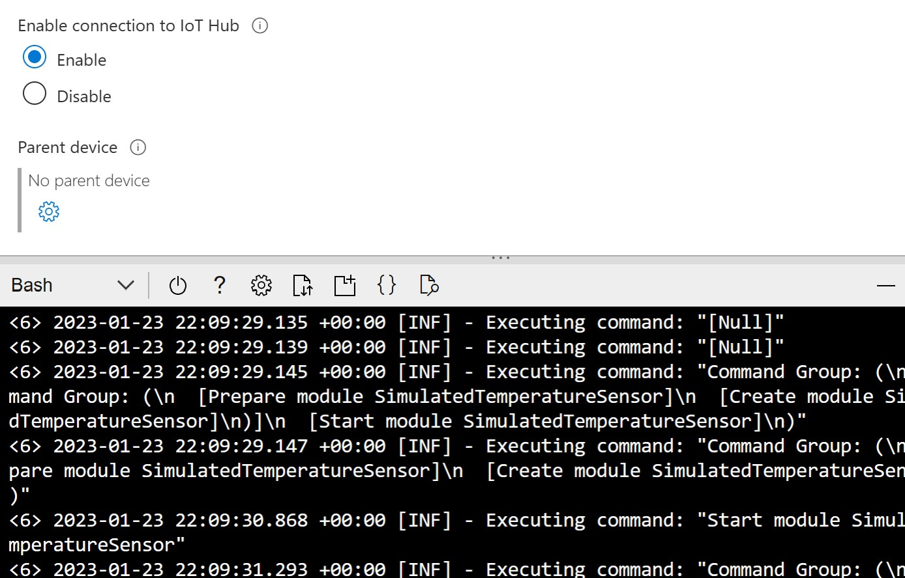

# IoT Edge & Defender for IoT Micro Agent Lab

## Lab 1: Install IoT Edge & Deploy Module on VM
### 1. SSH into VM and run following to install Moby (Docker), IoT Edge & Micro Agent
```
# Get Microsoft package list and add as source

    wget https://packages.microsoft.com/config/ubuntu/20.04/packages-microsoft-prod.deb -O packages-microsoft-prod.deb
    sudo dpkg -i packages-microsoft-prod.deb
    rm packages-microsoft-prod.deb

# Update package list and install Moby

    sudo apt-get update; \
    sudo apt-get install moby-engine

    # Check docker is running

    systemctl status docker

# Update package list and install IoT Edge and 
micro agent

    sudo apt-get update; 
    sudo apt-get install aziot-edge defender-iot-micro-agent-edge

# Configure IoT Edge runtime with Edge Device Connection String and apply configuration. Use connection string saved in Prerequisites Step 4

    sudo iotedge config mp --connection-string "***************"
    sudo iotedge config apply

# Check IoT Edge & Micro Agent status


    sudo iotedge system logs -- -f

    iotedge list

    sudo docker ps

    journalctl -u defender-iot-micro-agent –f

```

## 2. Deploy Simulated Temperature & Humidity Module on IoT Edge

# Portal

1. Open IoT Edge device in IoT Hub 

2. Select Set Modules 

3. Add marketplace module 

4. Search for "Simulated Temperature Sensor", Select 

5. Click Routes, review the route 

6. Click Review+Create to see the full Deployment manifest, detailing all modules, routes and associated desired properties 

7. Click Create to deploy modules to IoT Edge

8. Open Cloud shell connected to VM to view portal and shell together. Check 

9. Open Azure Device Explorer and add IoTHub connection using saved IoT Hub connection string, open edge device


# Azure CLI


## Lab 2: Configure Defender for IoT in IoT Hub

## Lab 3: Setup IoT Edge & Micro Agent in VM

## Lab 4: Analytics

## Clean Up
```
az group delete --name $resourceGroup
```


