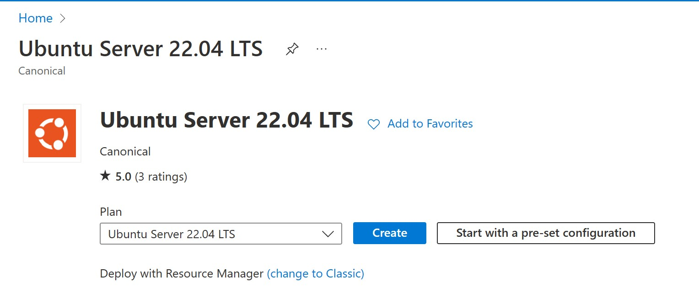
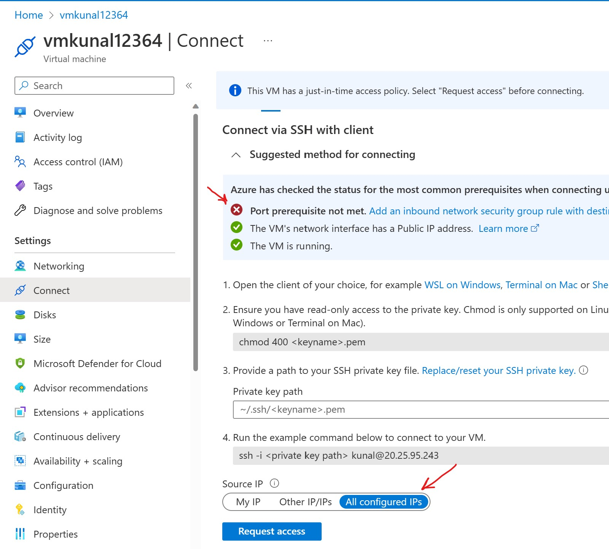
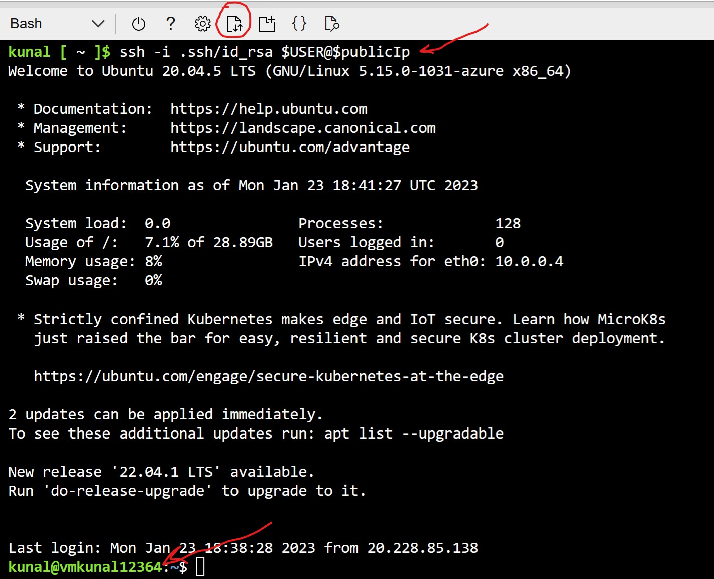

# Prerequisites (Use either Portal or CLI)

### Cloud Prerequisites 
#### Option: Using Portal ([CLI](./Lab Prerequisites.md#using-cli) will be quick)
1. Open Azure Subscription here - [Azure](https://portal.azure.com)
2. Create Resource Group 
3. Create IoT Hub S1 SKU and save iothubowner connection string 
4. Create IoT Edge device in IoT Hub and save primary connection string  
5. Create Log Analytics Workspace 
6. Create VM (to configure IoT Edge) Ubuntu 20.04 LTS DS2_V2 
7. Enable JIT or Open SSH port to VM 
8. SSH into VM via Cloud Shell 

#### Option: Using CLI 
1. Open Cloud Shell here - [Azure CLI](https://shell.azure.com)
    >First time you will required to create Storage account for CLI
2. Install & Update IoT Extension using commands at CLI prompt
    ``` 
    az extension add --name azure-iot
    az extension update --name azure-iot 
    ```
3. Store parameters to create unique resource names
    ```
    randomNumber=$RANDOM
    randomIdentifier=$USER$randomNumber

    subscriptionId=$(az account show --query id -o tsv)
    location="East US" 
    resourceGroup="IoT-LevelUp-$randomIdentifier" 
    iotHubName="IoT-LevelUp-Hub-$randomIdentifier"
    edgedeviceName="edgedevice"$randomNumber
    loganalyticsws="$randomIdentifier-logws"
    vmname="vm$randomIdentifier"

    #Store parameters to cloud storage
    echo "export subscriptionId="$subscriptionId > myconfig.log
    echo "export randomIdentifier="$randomIdentifier >> myconfig.log
    echo "export location="\"$location\" >> myconfig.log
    echo "export resourceGroup="$resourceGroup >> myconfig.log
    echo "export iotHubName="$iotHubName >> myconfig.log
    echo "export edgedeviceName="$edgedeviceName >> myconfig.log
    echo "export loganalyticsws="$loganalyticsws >> myconfig.log
    echo "export vmname="$vmname >> myconfig.log

    # Parameters can be restored later with command "source myconfig.log"
    

4. Create Resource Group for resources
    ```
    az group create --name $resourceGroup --location "$location" 
    ```
5. Create IoT Hub S1 SKU x 1  and save connection string in notepad for future use
    ```
    az iot hub create --name $iotHubName --resource-group $resourceGroup --sku S1  

    HUBCONNECTIONSTRING=$(az iot hub connection-string show -n $iotHubName --policy-name iothubowner --key-type primary --query "connectionString") 

    echo "Save this IoT Hub Connection String to notepad ="
    echo $HUBCONNECTIONSTRING
    

    ```
6. Create IoT Edge device in IoT Hub and save device connection string in notepad 
    ```
    az iot hub device-identity create -n $iotHubName -d $edgedeviceName --ee

    DEVICECONNECTIONSTRING=$(az iot hub device-identity connection-string show --device-id $edgedeviceName  --hub-name $iotHubName --key-type primary -o tsv)

    echo "Save this Device Connection String to notepad ="
    echo $DEVICECONNECTIONSTRING
    echo "export DEVICECONNECTIONSTRING="$DEVICECONNECTIONSTRING >> myconfig.log

    ```

7. Create Log Analytics Workspace
    ```
    az monitor log-analytics workspace create -g $resourceGroup -n $loganalyticsws
    az monitor log-analytics workspace show --resource-group $resourceGroup --workspace-name $loganalyticsws

    ```
8. Create VM with ssh key access via Cloud Shell, save username and IP address to notepad
    ```
    az vm create --resource-group $resourceGroup --name $vmname --image Canonical:0001-com-ubuntu-server-focal:20_04-lts:latest --generate-ssh-keys --size Standard_DS2_v2  --public-ip-sku Standard --nsg-rule SSH

    publicIp=$(az vm list-ip-addresses -g $resourceGroup -n $vmname --query [].virtualMachine.network.publicIpAddresses[][].ipAddress -o tsv)
    echo "export publicIp=$publicIp" >> myconfig.log

    ```

9.  Login to VM via Cloud Shell
    ```
    ssh -i ~/.ssh/id_rsa $USER@$publicIp

    ```
10. Optional - If using local PC/Desktop to SSH into the VM, upload public key to Cloud Shell and  append to authorized_keys in VM
    
    a. Use file upload in Cloud Shell top menu and select id_rsa.pub file from c:/users/<username>/.ssh/ folder

    b. In Cloud Shell run following command to copy the file into the VM

        
        scp -i .ssh/id_rsa id_rsa.pub $USER@$publicIp:~/.

    c. ssh into vm and append uploaded public key to authorized_keys

        ssh -i ~/.ssh/id_rsa $USER@publicIp
        cat id_rsa.pub >> ~/.ssh/authorized_keys
    d. Vm can now be accessed from your PC, replace username and ipaddress

        ssh -i ~/.ssh/id_rsa <username>@ipaddress

### NOTE - By Default SSH port rule will be removed by Defender for cloud after some time and needs to be explictly added if VM is not accessible


## Optional - If Cloud Shell timed out, use following command to recover configuration parameters from step 3
```
source myconfig.log

```

### Prequisites On PC or Local Machine
1. Install Azure Device Explorer [Azure Device Explorer](https://github.com/Azure/azure-iot-explorer/releases/tag/v0.15.4)
2. Install Git [Git](https://git-scm.com/downloads)


